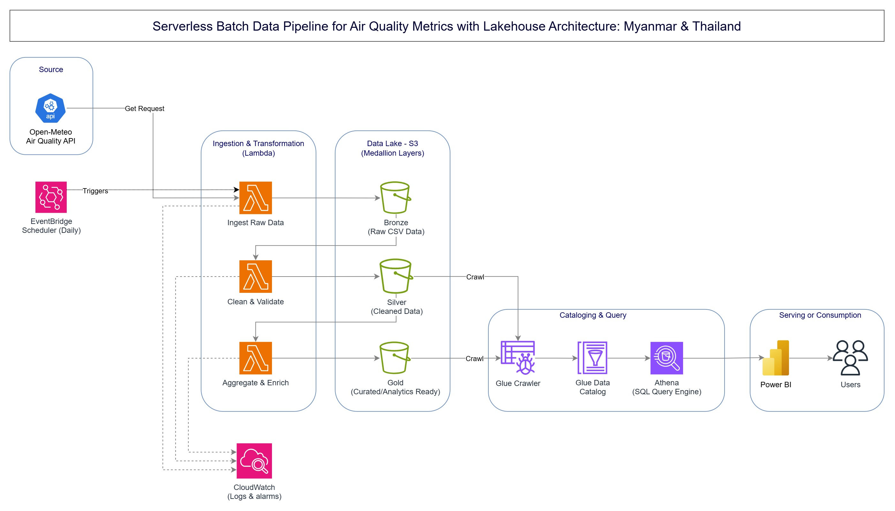

# AWS Serverless Batch Data Lakehouse: Regional Air Quality Monitoring (PM 2.5)

An end-to-end, serverless batch data pipeline and interactive analytics platform built on AWS to ingest, transform, aggregate, and visualize PM 2.5 air quality metrics across Myanmar and Thailand.

---

## 📌 Project Overview & Motivation

Seasonal haze and fine particulate matter (PM 2.5) pollution pose severe public health risks across Southeast Asia, particularly in Myanmar and Thailand. Access to clean, aggregated, and historical air quality data is critical for environmental awareness and data-driven decision-making.

This project was built to serve the public interest by transforming scattered API metrics into actionable insights. It implements an automated, cost-effective **Serverless Medallion Lakehouse Architecture on AWS** to process daily air quality data from the Open-Meteo REST API, serving curated datasets to interactive Power BI dashboards.

---

## 🏗️ System Architecture & Data Flow

The pipeline leverages a **Medallion Architecture (Bronze ➔ Silver ➔ Gold)** to maintain clear data lineage, high data quality, and optimized query performance:

1. **Ingestion Layer (Bronze):**
   * **AWS EventBridge Scheduler** triggers an **AWS Lambda** function daily.
   * Fetches raw REST API payloads from the **Open-Meteo Air Quality API**.
   * Saves raw data immutably into **Amazon S3 Bronze Bucket** (Landing Zone).

2. **Transformation Layer (Silver):**
   * **AWS Lambda** handles automated schema validation, data cleaning, timestamp parsing, and missing value imputation.
   * Stores cleaned, structural data into **Amazon S3 Silver Bucket**.

3. **Analytics & Curation Layer (Gold):**
   * Computes spatial-temporal metrics (Monthly & Hourly Averages, Medians, and Max values).
   * Persists curated, business-ready datasets into **Amazon S3 Gold Bucket**.

4. **Cataloging & Query Engine:**
   * Automated **AWS Glue Crawlers** scan S3 buckets to infer schema updates and sync metadata with the **AWS Glue Data Catalog**.
   * **Amazon Athena** executes serverless SQL queries against S3 Gold data or S3 Silver data with minimal scan overhead.

5. **Visualization Layer:**
   * **Power BI** connects directly to Amazon Athena via ODBC driver to render dynamic dashboards for decision-makers.

---

## 🛠️ Tech Stack & Cloud Infrastructure

* **Cloud Provider:** Amazon Web Services (AWS)
* **Compute / Serverless:** AWS Lambda, AWS EventBridge Scheduler
* **Storage:** Amazon S3 (Bronze, Silver, Gold Lakehouse Layers)
* **Data Catalog & Query:** AWS Glue Crawler, AWS Glue Data Catalog, Amazon Athena
* **Monitoring & Logs:** Amazon CloudWatch (Logs & Metric Alarms)
* **Visualization:** Power BI Desktop
* **Pipeline Design:** Medallion Architecture, Event-Driven ETL, Partition Pruning

---

## 📊 Analytics & Key Findings

The downstream Power BI dashboard highlights critical environmental patterns across major cities (Bangkok, Chiang Mai, Mae Sot, Yangon, Mandalay):

* **Seasonal Spikes:** Severe PM 2.5 levels peaking between **February and April** (frequently exceeding WHO Unhealthy Thresholds of `> 35.5 µg/m³`).
* **Diurnal Cycles:** Granular 24-hour analysis shows elevated pollution levels during early morning and late evening hours.
* **Monsoon Effect:** Clear drop to WHO Safe Standards (`<= 15 µg/m³`) during rainy season months (June – September).

---

## 🔒 Proprietary Notice & Implementation Details

> **Note on Source Code Access:**  
> The underlying AWS Lambda codebase, IAC templates, and repository configuration are maintained in a private repository for intellectual property protection and security best practices. 
> 
> Detailed architecture patterns, data flow designs, and schema structures are publicly documented here to demonstrate technical design and cloud engineering methodology.

---

## 📝 Disclaimer
*This project is built for analytical, research, and portfolio demonstration purposes using public data from Open-Meteo. It does not represent an official report from any government authority.*
